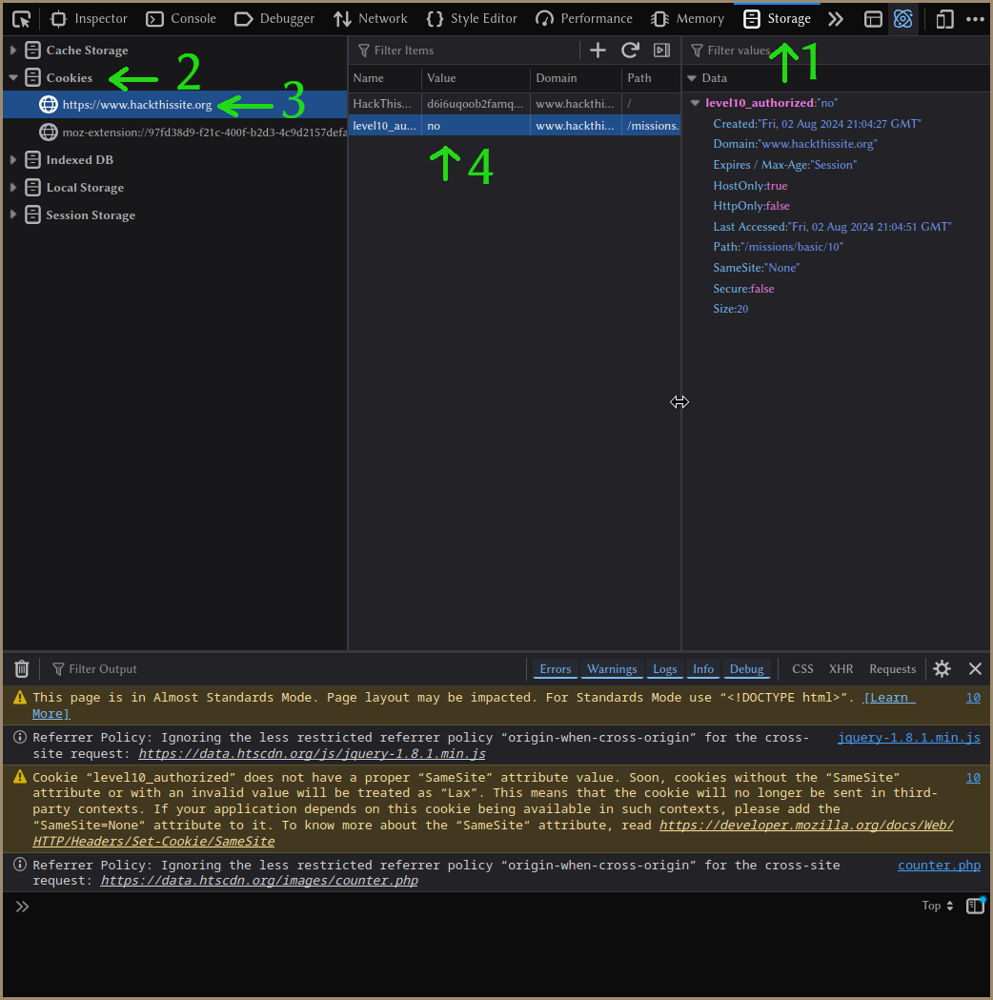

# Level 10

## Question

Enter password

Please enter a password to gain access to level 10

## Explanation

This challenge is test our understanding of authentication and cookies. We need
to check the cookies and manipulate them to pass the authentication.

## Solution

1. Open the developer tools in the browser.

2. Go to the `Storage` tab (in Chrome browser it's in the `Application` tab).

3. In the list at left side find the `Cookies` section and click on the domain
   of the challenge. (`https://www.hackthissite.org`)

4. Here you can find the list of cookies. There is a cookie with an interesting
   name `level10_authorized`.

5. The value is set to `no`. We can change it to `yes` to pass the
   authentication.

6. Refresh the page and you will see congratulations message.

{ width=50% }

## Answer

change the value of the cookie `level10_authorized` to `yes`
