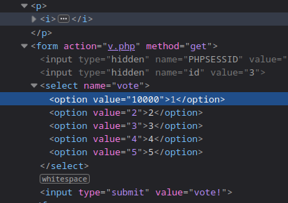

# Uncle Arnold's Local Band Review

## Question

Your friend is being cheated out of hundreds of dollars. Help him make things
even again!

From: HeavyMetalRyan

Message: Hey man, I need a big favor from you. Remember that website I showed
you once before? Uncle Arnold's Band Review Page? Well, a long time ago I made
a $500 bet with a friend that my band would be at the top of the list by the
end of the year. Well, as you already know, two of my band members have died in
a horrendous car accident... but this guy still insists that the bet is
on!

I know you're good with computers and stuff, so I was wondering, is there any
way for you to hack this website and make my band on the top of the list? My
band is Raging Inferno. Thanks a lot, man!

## Explanation

The voting values are in a form in a dropdown menu. The values that sent to
server are not checked. So, we can change the value of the dropdown menu to
vote for the band Raging Inferno.

## Solution

1. Go to the website and open the developer tools.

2. With the help of `Pick an element from the page` tool, select the dropdown
   menu for Raging Inferno.

3. Change the value one of the options to 10000.

4. Choose the modified option and submit the form.

## Answer

Identify that form method is GET and parameters are sent in the URL. Just have
to change vote value.
